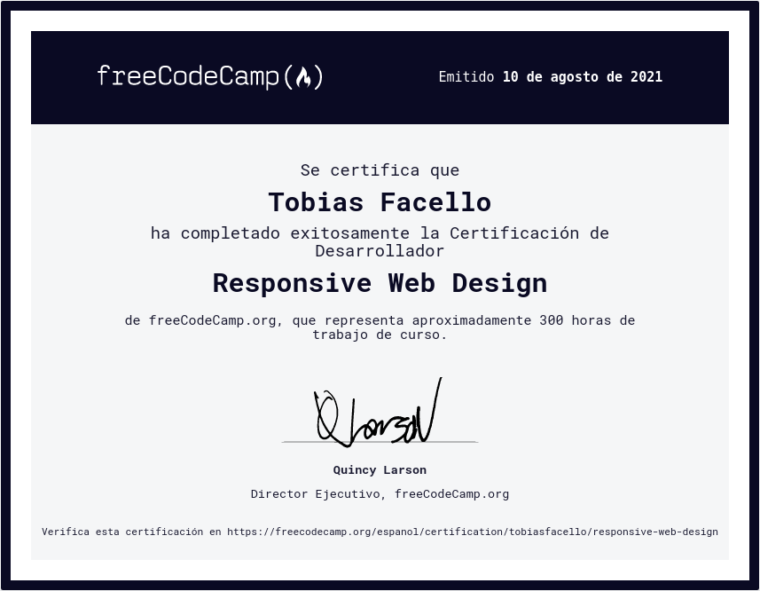

<h1 align="center">Proyectos FreeCodeCamp</h1>

Colección de proyectos y certificaciones completados.

 

<h2 align="center">Responsive Web Design<h3>
<h3 align="center"> Proyectos construidos con 🛠️ </h3>

  

 

- Proyecto #1: Build a Tribute Page | [Ver Proyecto](https://tobiasfacello-fcc-project-1.netlify.app/)
  

- Proyecto #2: Build a Survey Form | [Ver Proyecto](https://tobiasfacello-fcc-project-2.netlify.app/)

  
- Proyecto #3: Build a Product Landing Page | [Ver Proyecto](https://tobiasfacello-fcc-project-3.netlify.app/)
  

- Proyecto #4: Build a Technical Documentation Page | [Ver Proyecto](https://tobiasfacello-fcc-project-4.netlify.app/)
  

- Proyecto #5: Build a Personal Portfolio | [Ver Proyecto](https://tobiasfacello-fcc-project-5.netlify.app/)
  

  

