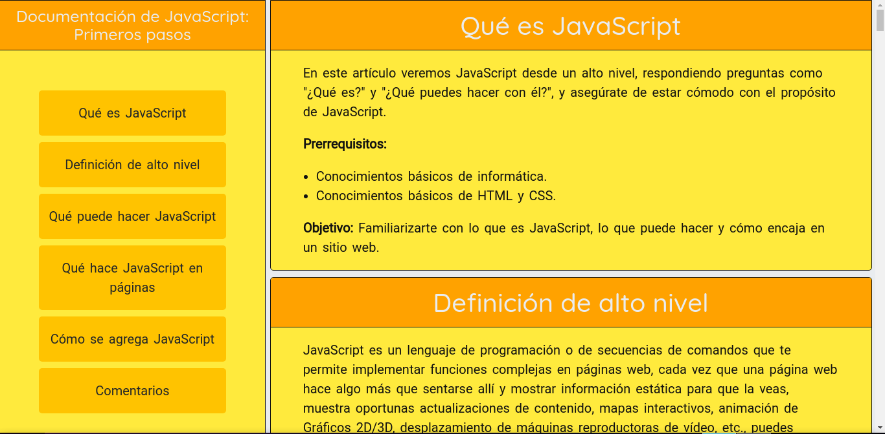

# fcc-project-4

## 📋 Proyecto #4 - Responsive Web Design: Construye una página de documentación técnica.

### FreeCodeCamp - Responsive Web Design / Project #4: Build a Technical Documentation Page.

<h3 align="center"> Construido con 🛠️ </h3>

  
  

### https://tobiasfacello-fcc-project-4.netlify.app/
  
### CodePen (Solution link): https://codepen.io/tobiasfacello/pen/BaRvLmQ
